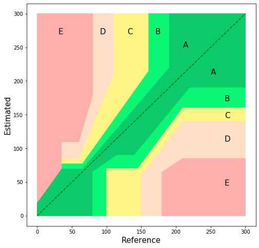
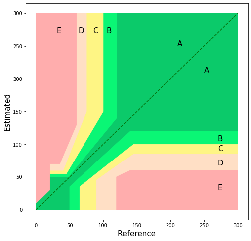

# ArterialPressure_ErrorGridAnalysis
 

This is Error grids for systolic arterial pressure. The horizontal axis represents arterial pressure values measured by a gold standard method, and the vertical axis represents arterial pressure values measured by a test device. The grid is divided into zones showing the degree of risk posed by the test device’s incorrect measurement: zone A represents no risk for the patient; zone B represents low risk; zone C represents moderate risk; zone D represents significant risk; and zone E represents dangerous risk. The colors are based on the survey together with the derived limits defining the risk zones to illustrate the fit of the zones.

This is Error Grid for mean arterial pressure. The horizontal axis represents arterial pressure values measured by a gold standard method, and the vertical axis represents arterial pressure values measured by a test device.
## Reference
Saugel, Bernd MD*; Grothe, Oliver PhD†; Nicklas, Julia Y. MD* Error Grid Analysis for Arterial Pressure Method Comparison Studies, Anesthesia & Analgesia: April 2018 - Volume 126 - Issue 4 - p 1177-1185 doi: 10.1213/ANE.0000000000002585
